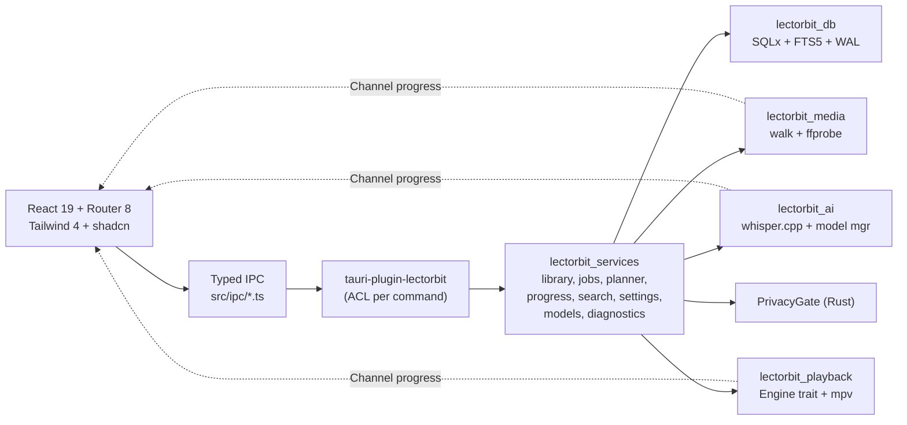
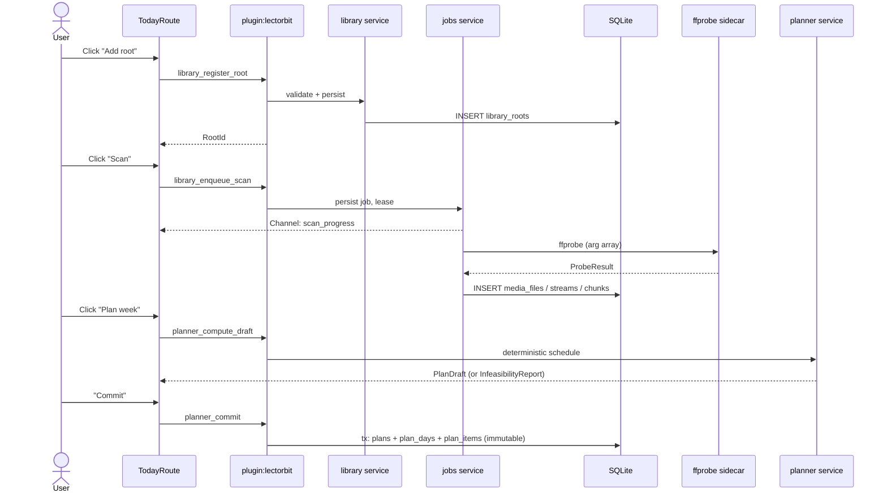
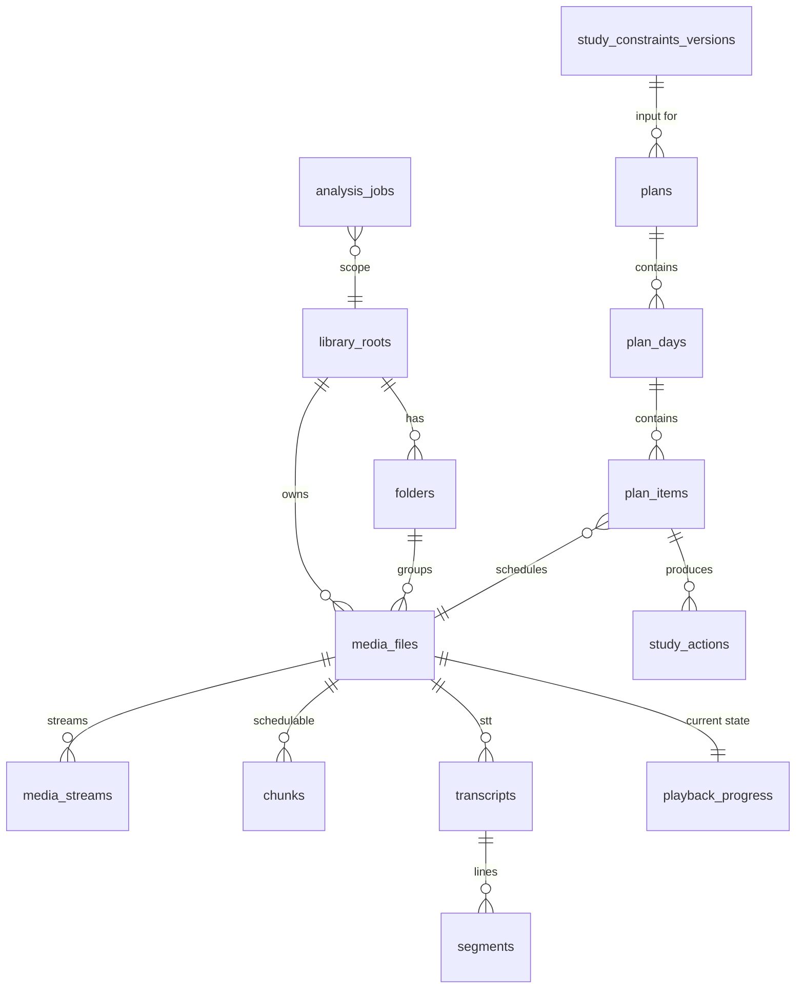

## Plan: LectorBit PRD v1.1 — Feature-by-Feature Implementation

**TL;DR.** The repo is currently scaffolded (workspace, migrations, internal Tauri plugin, `app_get_version` IPC bridge, React + TanStack Query + Router boilerplate, Vite hero template). This plan implements the full MVP slice from the PRD (`import → index → plan → play → progress → replan → search → diagnostics`) in 16 commit-sized features. Every commit moves one vertical slice end-to-end (DB → service → IPC → UI → tests), so the app stays runnable after each step and each commit is reviewable on its own. UI work uses the audited baseline (Tailwind v4 + shadcn/ui + TanStack Virtual) and follows the PRD's accessibility/UX rules.

**Implementation order (mirrors PRD §4.18).**

---

### Feature 0 — Bootstrap hardening & shell UX

**Slice.** Make the desktop shell look like LectorBit (not the Vite template), wire Tailwind v4 properly, add the app shell layout (sidebar + topbar + content area), install shadcn/ui CLI components, replace `index.html` title and favicon, configure CSP and Tauri security per PRD §4.13, set strict-mode defaults, and add the TanStack Query devtools-gated-to-dev pattern.

**Steps.**
1. Replace `lectorbit_frontend/src/App.tsx` (delete Vite hero), wire `app/App.tsx` from `main.tsx`.
2. Build `components/layout/AppShell.tsx` (sidebar nav: Home / Library / Routine / Search / Settings; topbar: app title + About link).
3. Add `index.css` Tailwind v4 import + design tokens (CSS variables for color/spacing/radius per shadcn flow).
4. Add ESLint + Prettier + strict TS settings; run `pnpm dlx shadcn@latest init` and commit only the config + the components used in later steps.
5. Tighten `tauri.conf.json`: CSP `default-src 'self'; script-src 'self'; style-src 'self' 'unsafe-inline'; img-src 'self' data: asset:` and `security.dangerousDisableAssetCspModification: false`.

**Relevant files.**
- `lectorbit_frontend/src/main.tsx`, `lectorbit_frontend/src/App.tsx`, `lectorbit_frontend/src/app/App.tsx`
- `lectorbit_frontend/src/components/layout/AppShell.tsx` *(new)*
- `lectorbit_frontend/src/index.css`, `lectorbit_frontend/index.html`
- `lectorbit_backend/src-tauri/tauri.conf.json`

**Verification.** `pnpm dev` opens a styled empty shell; `cargo tauri dev` runs the desktop app; CSP locks down origins.

---

### Feature 1 — DB connection, migrations, tracing redaction (FR-01)

**Slice.** Stand up the real `lectorbit_db` crate: SQLite pool, FK/WAL/busy_timeout pragmas, embedded migration runner, structured error mapping (`sqlx::Error → LectorError::Database`), and a `RedactingLayer` for `tracing-subscriber` that scrubs absolute paths and secret-looking keys from logs.

**Steps.**
1. In `lectorbit_db/src/lib.rs`: add `pub struct Db { pool: sqlx::SqlitePool }`, `pub async fn open(path: &Path) -> Result<Db, LectorError>`, `pub async fn migrate(&self) -> Result<(), LectorError>`.
2. In `lectorbit_db/src/migrations.rs`: use `sqlx::migrate!("../../migrations")` macro; reject any non-`2026-08-08_*.sql` file in tests.
3. Add `lectorbit_db/src/redact.rs` with a `tracing_subscriber::Layer` that masks `path=` / `file=` / `secret=` / `token=` values.
4. Wire into `src-tauri/src/lib.rs::run()`: build data dir via `tauri::path::app_data_dir`, open DB, run migrations, init subscriber with redaction.
5. Tests: `crates/lectorbit_db/tests/migrations.rs` runs migrations on an in-memory SQLite and asserts `media_files`, `plans`, `analysis_jobs` exist; `tests/redaction.rs` asserts a synthetic event containing `C:\Users\foo\bar.mp4` is logged as `<redacted:path>`.

**Relevant files.**
- `lectorbit_backend/crates/lectorbit_db/src/{lib.rs,migrations.rs,redact.rs}` *(rewrite/extend)*
- `lectorbit_backend/crates/lectorbit_db/tests/{migrations.rs,redaction.rs}` *(new)*
- `lectorbit_backend/src-tauri/src/lib.rs`

**Verification.** `cargo test -p lectorbit_db` green; app boots, creates `lectordb.sqlite` under `app_data_dir`, logs show no absolute paths.

---

### Feature 2 — App bootstrap & diagnostics IPC (FR-01, FR-15)

**Slice.** Expose `app_get_diagnostics` (privacy-safe env summary: app version, OS, arch, DB path basename, sidecar/model manifest status, feature flags) so Settings → Diagnostics can render it.

**Steps.**
1. Add `crates/lectorbit_services/src/diagnostics.rs` with `pub struct DiagnosticsReport` and `pub async fn collect(db: &Db) -> DiagnosticsReport`.
2. Add plugin command `app_get_diagnostics` in `tauri-plugin-lectorbit` with permission `lectorbit:allow-app-get-diagnostics`.
3. Update `permissions/default.toml` and `capabilities/default.json`.
4. Add `ipc/app.ts::getDiagnostics()`, add React Query key `['app','diagnostics']`.
5. Build `features/settings/DiagnosticsPanel.tsx` (renders report; "copy to clipboard" button; never shows absolute paths).

**Relevant files.**
- `lectorbit_backend/plugins/tauri-plugin-lectorbit/src/lib.rs`, `permissions/default.toml`
- `lectorbit_backend/src-tauri/capabilities/default.json`
- `lectorbit_frontend/src/ipc/app.ts`
- `lectorbit_frontend/src/features/settings/DiagnosticsPanel.tsx` *(new)*

**Verification.** Unit test for `DiagnosticsReport` (path fields are basenames only); UI panel renders without leaking host paths.

---

### Feature 3 — Library root authorization (FR-02)

**Slice.** Dedicated picker + register/unregister/list roots. Frontend never submits arbitrary absolute paths; the Rust command opens the native folder dialog, canonicalizes, validates, and stores only safe metadata + an opaque `RootId`.

**Steps.**
1. `services/library.rs::register_root(path: PathBuf, display_name: String) -> LibraryRoot` validates: canonicalize, ensure exists & is dir, reject symlink loops, reject `..` traversal, reject system roots (`C:\Windows`, `/proc`, `/sys`).
2. `services/library.rs::list_roots()`, `revoke_root(id)`, `reactivate_root(id)`.
3. Plugin commands `library_register_root`, `library_list_roots`, `library_revoke_root`, `library_reactivate_root` with one permission per command.
4. Frontend: `features/library/RootsManager.tsx` (TanStack Query `useRoots`, mutation on register; confirmation dialog for revoke).
5. Channel for folder-pick progress is **not** used here (single click → single command); event `library-root-unavailable` for missing roots.

**Relevant files.**
- `lectorbit_backend/crates/lectorbit_services/src/library.rs` *(real impl)*
- `lectorbit_backend/plugins/tauri-plugin-lectorbit/src/lib.rs` *(new commands)*
- `lectorbit_frontend/src/features/library/RootsManager.tsx` *(new)*
- `lectorbit_frontend/src/ipc/library.ts` *(new)*

**Verification.** Property test: `register_root` rejects every variant of `..` injection, symlink-escape, and Windows reserved path; UI list updates on register.

---

### Feature 4 — Scan, watcher, ffprobe metadata, Channel progress (FR-03, FR-04, FR-05)

**Slice.** Recursive scan + ffprobe adapter + Channel-streamed progress + crash-resumable jobs. This is the biggest single commit but stays cohesive because scan ↔ probe ↔ progress are one transaction.

**Steps.**
1. `lectorbit_media::ffprobe::probe(&Path) -> ProbeResult` invokes ffprobe with an arg array (`-v quiet -print_format json -show_format -show_streams`), parses JSON, maps to `ProbeResult { duration: Seconds, streams: Vec<StreamMeta> }`.
2. `lectorbit_media::scan::walk(root) -> impl Stream<Item=PathBuf>` uses `walkdir` (no symlink loops, skip hidden dirs).
3. `services/jobs.rs`: `JobQueue` with bounded `tokio::sync::Semaphore`, heartbeat every 2s, persisted lease in `analysis_jobs`, recovery on startup (`status='running' AND updated_at < now-30s` → requeue).
4. `services/library.rs::enqueue_scan(root_id) -> JobId`; Channel-based `scan_progress` event stream: `{ job_id, files_total, files_done, current_path_basename, phase }`.
5. Plugin commands: `library_enqueue_scan`, `library_list_media` (cursor-paginated by `media_files.id`), `scan_subscribe` (returns a Tauri Channel id).
6. Frontend: `features/library/ScanProgress.tsx` consumes the Channel via `@tauri-apps/api/core::Channel`; `features/library/LibraryTable.tsx` uses TanStack Virtual for ≥200 rows.

**Relevant files.**
- `lectorbit_backend/crates/lectorbit_media/src/{ffprobe.rs,scan.rs}` *(new)*
- `lectorbit_backend/crates/lectorbit_services/src/{library.rs,jobs.rs}` *(rewrite)*
- `lectorbit_backend/plugins/tauri-plugin-lectorbit/src/lib.rs`
- `lectorbit_frontend/src/ipc/scan.ts` *(new)*, `src/features/library/{ScanProgress,LibraryTable}.tsx` *(new)*

**Verification.** Integration test against `fixtures/media/` (corrupt + valid + nested Unicode); cancel-restart recovers a stale running job; UI virtualizes 10k rows under 100ms.

---

### Feature 5 — Coarse chunking from duration (FR-08)

**Slice.** Generate schedulable 20–30-minute chunks per media even before any AI analysis. Each `chunk` becomes the unit the planner schedules.

**Steps.**
1. Add `chunks` table (migration `2026-08-08_0002_chunks.sql`): `(id TEXT PK, media_id TEXT FK, idx INT, start_ms INT, end_ms INT, UNIQUE(media_id,idx))`.
2. `services/library.rs::derive_chunks(media_id, duration_ms, target_min=25) -> Vec<Chunk>` (last chunk may be shorter).
3. Trigger derivation inside scan completion (one transaction per media).
4. Frontend: `LibraryTable` shows chunk count + total study minutes per row.

**Relevant files.**
- `lectorbit_backend/migrations/2026-08-08_0002_chunks.sql` *(new)*
- `lectorbit_backend/crates/lectorbit_services/src/library.rs`

**Verification.** Property test: `derive_chunks(d=4500s)` yields 3 chunks of 1500s; UI shows total study minutes = `ceil(duration / target_seconds)`.

---

### Feature 6 — Study constraints (FR-09)

**Slice.** Versioned, immutable inputs for the planner. Default-constraints seeded on first boot; UI form to edit + a "freeze" action that snapshots a new version referenced by future plans.

**Steps.**
1. Migration `2026-08-08_0003_constraints_versions.sql`: `study_constraints_versions(id, user_id, payload_json, created_at)`; mark current table as a view-materialized latest.
2. `services/models.rs::StudyConstraints` (typed: `daily_minutes: u16`, `allowed_weekdays: [u8;7]`, `max_continuous_min: u16`, `catch_up: bool`, `speed: f32`, `rest_pattern: RestPattern`, `priorities: HashMap<MediaId,u8>`, `dependencies: Vec<(MediaId,MediaId)>`, `deadlines: Vec<(MediaId,NaiveDate)>`).
3. Validator: dependencies must form a DAG (cycle detection), deadlines ≤ horizon, speed ∈ [0.5, 3.0].
4. Plugin commands `constraints_get`, `constraints_freeze`, `constraints_set_active_version`.
5. Frontend: `features/settings/ConstraintsEditor.tsx` (RHF + Zod; mirror the Rust validator client-side as a UX nicety, never authoritative).

**Relevant files.**
- `lectorbit_backend/migrations/2026-08-08_0003_constraints_versions.sql` *(new)*
- `lectorbit_backend/crates/lectorbit_services/src/{models.rs,settings.rs}`

**Verification.** Unit test for cycle detection on `[(A,B),(B,C),(C,A)]` → `Invalid`; frozen versions cannot be edited.

---

### Feature 7 — Deterministic planner (FR-10)

**Slice.** Feasibility-first scheduler. Effective duration = `raw_ms / speed`. Hard constraints are never violated; soft scoring ranks within the feasible set. Returns either a feasible `Plan` (immutable) or `InfeasibilityReport { reasons, alternatives }`.

**Steps.**
1. `services/planner.rs::PlanInputs { horizon: NaiveDate, constraints: StudyConstraints, media: Vec<MediaWithChunks> }`.
2. Algorithm (greedy + local repair):
   - Compute `daily_budget_min = constraints.daily_minutes`.
   - For each day in horizon, assign chunks in topological order (dependencies first), respecting `max_continuous_min` (insert breaks), `allowed_weekdays`, and deadlines.
   - Catch-up mode redistributes missed-day budget forward.
   - If over budget: drop lowest-priority lowest-urgency items and record the reason; never silently exceed the daily budget.
3. `services/planner.rs::commit(plan: PlanDraft) -> PlanId` runs one transaction: insert `plans`, `plan_days`, `plan_items`; mark the previous active plan `archived_at=now`; one row in `audit_events`.
4. Plugin commands `planner_compute_draft`, `planner_commit`, `plan_get_active`, `plan_get_by_id`.
5. Frontend: `features/planner/PlanPreview.tsx` (preview before commit; shows feasibility report; "Try alternatives" dropdown).

**Relevant files.**
- `lectorbit_backend/crates/lectorbit_services/src/planner.rs` *(rewrite)*
- `lectorbit_backend/crates/lectorbit_services/src/models.rs`
- `lectorbit_frontend/src/features/planner/PlanPreview.tsx` *(new)*

**Verification.** Golden tests: (a) 5-day horizon, daily=60min, 8 media × 30min → fits exactly; (b) daily=60min, 8 × 30min, allowed_weekdays=[Mon,Wed] only → feasible with weekly pattern; (c) over budget → `InfeasibilityReport` lists the lowest-priority drop with rationale. Property test: no plan ever exceeds `daily_minutes` or schedules on a non-allowed weekday.

---

### Feature 8 — Routine/Today view (FR-12 prep)

**Slice.** Read the active plan for "today" and render the daily agenda with progress chips. No playback yet (Feature 9).

**Steps.**
1. `services/planner.rs::today_agenda(date) -> Vec<AgendaItem>` joins `plan_items` + `playback_progress` (left join, 0 if absent).
2. Plugin command `plan_today`.
3. Frontend: `features/routine/TodayRoute.tsx` (default route) — chronological list, estimated minutes per item, completion checkboxes (writes a `study_action` of kind `finished`).

**Relevant files.**
- `lectorbit_backend/plugins/tauri-plugin-lectorbit/src/lib.rs`
- `lectorbit_frontend/src/routes/home/HomeRoute.tsx` *(replace stub)*
- `lectorbit_frontend/src/features/routine/TodayRoute.tsx` *(new)*

**Verification.** After committing a plan in Feature 7, Today view shows items in order; toggling a checkbox adds a `study_action` and triggers a refetch.

---

### Feature 9 — PlaybackEngine + mpv spike + durable progress (FR-11)

**Slice.** Implement the `PlaybackEngine` trait, ship a no-op `MockPlaybackEngine` for tests and an `MpvIpcEngine` that talks to mpv over its JSON IPC socket (Phase-0 spike: validate socket path per-OS; fall back to mock if mpv not present). Periodically checkpoint `playback_progress` from a 2s tokio interval and on every pause/seek/close.

**Steps.**
1. `lectorbit_playback::engine::MockPlaybackEngine` (in-memory) + tests.
2. `lectorbit_playback::mpv::MpvIpcEngine` spawns the bundled `mpv` binary with `--idle=once --input-ipc-server=<temp>`, then issues `loadfile`, `set_property time-pos`, etc. via newline-delimited JSON.
3. `services/progress.rs::checkpoint_loop(engine, db)` with cancellation token; coalesces writes (≤1/2s).
4. Completion rule: a media is `done` when `watched_coverage_ms ≥ 0.95 * duration_ms` over a sliding 30s window **or** the user marks it via study action.
5. Plugin commands `playback_open`, `playback_play`, `playback_pause`, `playback_seek`, `playback_set_speed`, `playback_current_position`, `playback_close`, `progress_get`.
6. Frontend: `features/player/PlayerRoute.tsx` + a tiny HTML5 `<video>` fallback when the mpv adapter is unavailable (so the app stays usable on dev machines without mpv).

**Relevant files.**
- `lectorbit_backend/crates/lectorbit_playback/src/{engine.rs,mpv.rs}` *(new)*
- `lectorbit_backend/crates/lectorbit_services/src/progress.rs` *(rewrite)*
- `lectorbit_frontend/src/features/player/PlayerRoute.tsx` *(new)*

**Verification.** Unit test on mock engine: seek → checkpoint reflects new position; integration test in CI runs with the mock only (mpv requires a GUI/display and is out-of-band for unit tests); manual smoke on Windows/macOS/Linux documents the mpv launch path.

---

### Feature 10 — Study actions + replan (FR-12)

**Slice.** Durable actions feed the planner; replan creates a new immutable plan version, preserving completed history.

**Steps.**
1. `services/progress.rs::record_action(kind, plan_item_id?, media_id?, payload?) -> StudyActionId` writes append-only.
2. `services/planner.rs::replan(action_filter: ActionFilter) -> PlanDraft` (default: only unfinished future work).
3. Plugin commands `actions_record`, `planner_replan`.
4. Frontend: `features/routine/TodayRoute.tsx` adds buttons "Done / Postpone / Skip / Split"; mutation invalidates `['plan','today']`.

**Relevant files.**
- `lectorbit_backend/crates/lectorbit_services/src/{progress.rs,planner.rs}`
- `lectorbit_frontend/src/features/routine/TodayRoute.tsx`

**Verification.** Test: marking item done, then replanning, removes it from the new plan and preserves it in history; a postponed item shifts to the next allowed day.

---

### Feature 11 — Search (FTS5 over media labels) (FR-13)

**Slice.** Cheap, deterministic, FTS5-backed search. Only media labels + safe filenames in v1; transcripts join in Feature 12. Returns paginated `{ media_id, snippet, rank }`.

**Steps.**
1. Migration `2026-08-08_0004_media_fts.sql`: `CREATE VIRTUAL TABLE media_fts USING fts5(display_name, path_tokens, content='')`. Trigger-based population on `media_files` insert/update.
2. `services/search.rs::search_media(query, limit, offset) -> Vec<SearchHit>` (sanitize FTS5 query; reject `NEAR()` injection from the frontend).
3. Plugin command `search_media`.
4. Frontend: `features/search/SearchRoute.tsx` with debounced input, TanStack Query `['search', q]`, virtualized results.

**Relevant files.**
- `lectorbit_backend/migrations/2026-08-08_0004_media_fts.sql` *(new)*
- `lectorbit_backend/crates/lectorbit_services/src/search.rs` *(rewrite)*
- `lectorbit_frontend/src/features/search/SearchRoute.tsx` *(new)*

**Verification.** p95 ≤ 300ms against 10k rows; FTS5 injection attempt `" OR 1=1 --` returns no rows, not all rows.

---

### Feature 12 — whisper.cpp model manager + transcription (FR-06, FR-07)

**Slice.** On-demand model download (manifest-pinned: id, version, expected_size, sha256, source, license), resumable, verified. Transcription job = one `analysis_jobs` row, progress over a Channel, segments written to `transcripts` + FTS5 mirror.

**Steps.**
1. `sidecars/manifests/whisper-models.json` with `{id, version, size_bytes, sha256, source_url, license}` for `tiny.en`, `base.en`, `small.en`.
2. `lectorbit_ai::model_manager::download(id, dest, on_progress)` streams to disk with sha256 verification and resume via HTTP `Range`.
3. `lectorbit_ai::whisper::transcribe(media_id, model_id, on_progress) -> Vec<Segment>` shells out to the whisper.cpp sidecar with an arg array (no shell strings).
4. `services/jobs.rs` schedules transcription jobs with the same heartbeat/lease machinery as scan.
5. Migration `2026-08-08_0005_transcripts.sql`: `transcripts`, `segments`, `transcripts_fts`; trigger-based FTS mirror.
6. Plugin commands `models_list`, `models_download` (Channel), `models_remove`, `analysis_enqueue_transcribe`, `analysis_subscribe` (Channel).
7. Frontend: `features/analysis/ModelsPanel.tsx` (download/remove buttons with progress bar); extend `SearchRoute` to query `transcripts_fts` and render timestamped hits with a "Jump to mm:ss" button.

**Relevant files.**
- `lectorbit_backend/sidecars/manifests/whisper-models.json` *(new)*
- `lectorbit_backend/crates/lectorbit_ai/src/{model_manager.rs,whisper.rs}` *(new)*
- `lectorbit_backend/migrations/2026-08-08_0005_transcripts.sql` *(new)*
- `lectorbit_backend/plugins/tauri-plugin-lectorbit/src/lib.rs`
- `lectorbit_frontend/src/features/analysis/ModelsPanel.tsx` *(new)*

**Verification.** Unit test for `download`: corrupt sha256 → row marked `failed` and partial file removed; transcript search finds a known phrase; timestamp jumps open the player at the correct position.

---

### Feature 13 — Privacy gate, settings, consent ledger (FR-14)

**Slice.** Rust-side gate `PrivacyGate { local_only: AtomicBool }` blocks any cloud-bound adapter until consent. Settings UI writes through typed IPC; consent events append to `consent_events`.

**Steps.**
1. `services/settings.rs::PrivacyGate` with `check(scope: &str) -> Result<(), LectorError>`.
2. `services/settings.rs::record_consent(scope, granted, payload)` writes `consent_events`; on grant, flips the gate.
3. Plugin commands `settings_get`, `settings_set`, `consent_record`, `consent_list`.
4. Frontend: `features/settings/SettingsRoute.tsx` with toggles for "Allow model download" / "Allow analytics" / "Allow cloud enrichment", each prompting a confirmation dialog before recording `granted=true`.

**Relevant files.**
- `lectorbit_backend/crates/lectorbit_services/src/settings.rs` *(rewrite)*
- `lectorbit_backend/plugins/tauri-plugin-lectorbit/src/lib.rs`
- `lectorbit_frontend/src/features/settings/SettingsRoute.tsx` *(new)*

**Verification.** Unit test: with `local_only=true`, calling any cloud adapter returns `PermissionDenied`; toggling consent flips behavior.

---

### Feature 14 — Audit + redaction in diagnostics (FR-15)

**Slice.** Audit `register_root`, `revoke_root`, `plan_commit`, `replan`, `consent_record`, `playback_close`. Diagnostics export never includes absolute paths, content, or secrets (use a regex allowlist for env keys; redact everything else).

**Steps.**
1. `services/diagnostics.rs::export_log_bundle() -> Vec<u8>` returns a tar.gz with redacted `tracing` JSON.
2. `services/diagnostics.rs::audit(category, action, payload)` writes `audit_events`.
3. Plugin commands `audit_list`, `diagnostics_export_bundle`.
4. Frontend: `DiagnosticsPanel` gains an "Export bundle" button with progress.

**Relevant files.**
- `lectorbit_backend/crates/lectorbit_services/src/diagnostics.rs` *(extend)*

**Verification.** Test: log bundle contains no `C:\` or `/Users/...` substrings; bundle round-trips through `tar -tzf`.

---

### Feature 15 — UI polish, accessibility, desktop-UX pass

**Slice.** Premium UI/UX + desktop performance per PRD §4.4 (p95 ≤ 150ms paginated reads, virtualization ≥200 rows, keyboard-complete core flows).

**Steps.**
1. Install shadcn components actually used: `button`, `dialog`, `dropdown-menu`, `tabs`, `toast` (Sonner), `tooltip`, `progress`, `skeleton`, `command` (palette), `scroll-area`, `sheet`, `switch`, `slider`, `table`.
2. Add a Command palette (`features/shell/CommandPalette.tsx`) wired to `Cmd/Ctrl+K`: nav, register root, jump to Today, search.
3. Toast system via Sonner for job lifecycle (queued → running → done/failed) and for the Channel progress coalescer.
4. Drawer below 1280px width (PRD §4.8): sidebar collapses into a `Sheet`.
5. Reduced-motion media query respected; focus rings visible; ARIA labels on icon-only buttons.
6. Performance: React Query `staleTime` tuned per resource; lists use `@tanstack/react-virtual`; Channel messages coalesced with a 100ms trailing throttle before React state.
7. Empty states and skeletons for every list view.

**Relevant files.**
- `lectorbit_frontend/src/components/ui/*` *(shadcn adds)*
- `lectorbit_frontend/src/features/shell/CommandPalette.tsx` *(new)*
- `lectorbit_frontend/src/components/layout/AppShell.tsx`

**Verification.** Lighthouse-style audit (manual): tab order, focus visibility, screen-reader labels; DevTools profiler: virtualized 10k rows scrolls at 60fps.

---

## Cross-cutting conventions (apply to every commit)

- **Conventional Commits.** Every commit message is one of:
  `feat(scope): …`, `fix(scope): …`, `perf(scope): …`, `refactor(scope): …`, `test(scope): …`, `chore(scope): …`, `docs(scope): …`.
  Suggested scopes per commit: `db`, `services`, `plugin`, `ipc`, `ui`, `library`, `planner`, `playback`, `progress`, `search`, `ai`, `settings`, `diagnostics`, `release`.
- **Feature flags.** Each feature commit lands behind the next available route or toggle so partial states are reachable.
- **Tests.** Unit tests live next to the module; integration tests under `crates/<crate>/tests/`. Every commit must leave `cargo test --workspace` and `pnpm test` green.
- **No backend truth in the renderer.** React state caches, never decides.
- **Privacy by default.** Anything that could touch the network or a secret must call `PrivacyGate::check` first.

---

## Diagrams

### Architecture (one screen)

### Scan → Plan → Play sequence

### Core schema (relevant subset)

---

## Verification (end-to-end, run after Feature 15)

1. **Automated.** `cargo fmt --check`, `cargo clippy --workspace -- -D warnings`, `cargo test --workspace`, `pnpm lint`, `pnpm typecheck`, `pnpm test`.
2. **Manual smoke (PRD §4.19 readiness checklist).**
   - Cold start p95 ≤ 3s on reference SSD.
   - 10k media rows paginated read p95 ≤ 150ms.
   - First plan in ≤ 30s from a fresh root.
   - Toggle local-only → cloud call returns `permission_denied`.
   - Diagnostics bundle has zero absolute paths.
   - Keyboard-only: register root → scan → plan → play → mark done → replan.
3. **Security.** Permission-deny smoke (strip `lectorbit:allow-*` from capability and confirm the corresponding command returns `permission_denied`), traversal/symlink escape, sidecar arg array (no shell string), FTS5 injection.
4. **Release.** Three-OS Tauri build matrix green; updater signature verified; pnpm-lock + Cargo.lock committed.

---

## Relevant files (index)

**Backend (Rust)**
- `lectorbit_backend/Cargo.toml`, `rust-toolchain.toml` *(add if missing)*
- `lectorbit_backend/src-tauri/{Cargo.toml,src/lib.rs,tauri.conf.json,capabilities/default.json}`
- `lectorbit_backend/plugins/tauri-plugin-lectorbit/{Cargo.toml,src/lib.rs,permissions/default.toml,build.rs}`
- `lectorbit_backend/crates/lectorbit_core/src/{lib.rs,error.rs,ids.rs,units.rs}`
- `lectorbit_backend/crates/lectorbit_services/src/{lib.rs,library.rs,jobs.rs,planner.rs,progress.rs,search.rs,settings.rs,diagnostics.rs,models.rs}`
- `lectorbit_backend/crates/lectorbit_db/src/{lib.rs,migrations.rs,redact.rs}`
- `lectorbit_backend/crates/lectorbit_media/src/{lib.rs,ffprobe.rs,scan.rs}`
- `lectorbit_backend/crates/lectorbit_ai/src/{lib.rs,model_manager.rs,whisper.rs}`
- `lectorbit_backend/crates/lectorbit_playback/src/{lib.rs,engine.rs,mpv.rs}`
- `lectorbit_backend/migrations/2026-08-08_0001_initial.sql` + `0002..0005` *(added across features)*
- `lectorbit_backend/sidecars/manifests/{whisper-models.json,ffmpeg.json,mpv.json}` *(added in Features 4, 9, 12)*
- `lectorbit_backend/tests/integration/*` *(smoke, planner golden, security)*

**Frontend (React/TS)**
- `lectorbit_frontend/package.json`, `vite.config.ts`, `tsconfig*.json`, `eslint.config.js`
- `lectorbit_frontend/index.html`, `src/main.tsx`, `src/App.tsx`, `src/index.css`
- `lectorbit_frontend/src/app/App.tsx`
- `lectorbit_frontend/src/components/layout/AppShell.tsx`, `src/components/ui/*`
- `lectorbit_frontend/src/routes/index.tsx`, `src/routes/{home,about}/*`, plus new `routine/library/player/search/settings/analysis` routes
- `lectorbit_frontend/src/features/{library,routine,planner,player,search,analysis,settings,shell}/*` *(new feature slices)*
- `lectorbit_frontend/src/ipc/{app,library,scan,planner,plan,playback,progress,search,models,settings,consent,audit}.ts` *(new)*
- `lectorbit_frontend/src/query/{keys.ts,options.ts}` *(new — centralize TanStack keys)*
- `lectorbit_frontend/src/state/{ui.ts,palette.ts}` *(new — Zustand, ephemeral only)*
- `lectorbit_frontend/src/domain/{errors.ts,models.ts}` *(extend)*
- `lectorbit_frontend/src/lib/{format.ts,a11y.ts,validation.ts}` *(new)*
- `lectorbit_frontend/src/test/setup.ts`, plus per-feature `*.test.ts(x)`

**Docs / CI**
- `project-docs/TECHNOLOGY_BASELINE_2026-08.md` *(kept authoritative)*
- `.github/workflows/{ci.yml,release.yml}` *(added in a later release-prep commit; not in MVP scope unless requested)*
