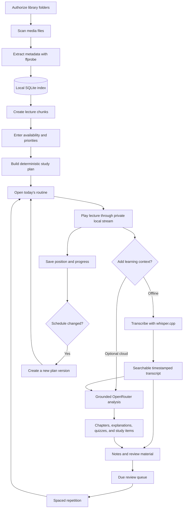
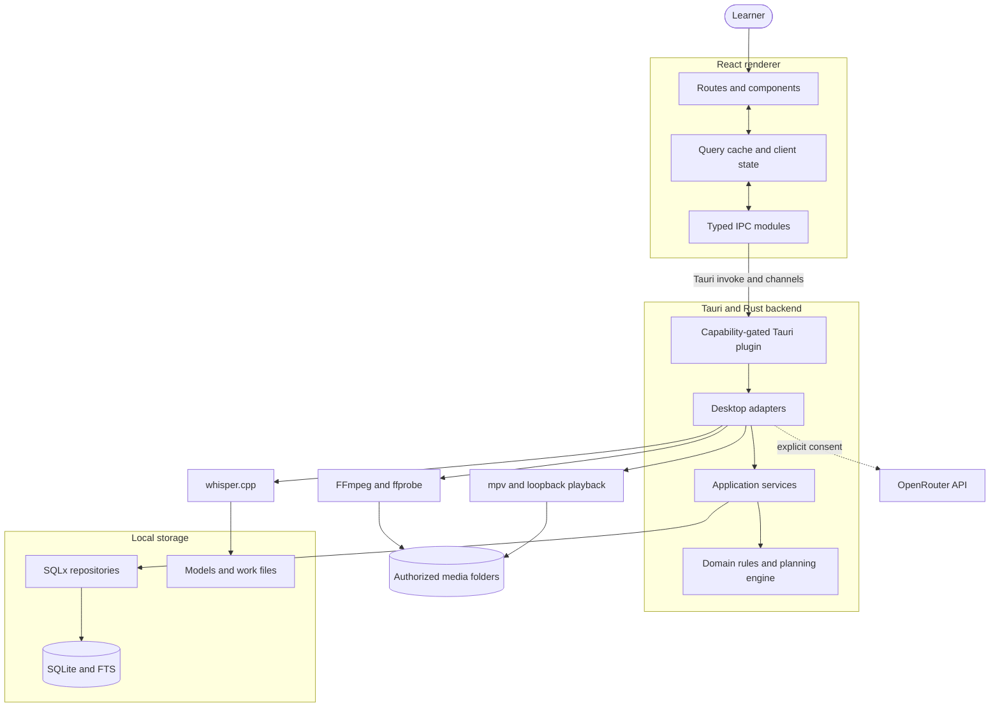

# LectorBit

> A local-first desktop application for planning, watching, transcribing, and reviewing video lectures.

LectorBit turns folders of lecture videos into a structured study system. It indexes user-approved folders, extracts media metadata locally, creates deterministic study plans, tracks playback progress, produces searchable English or Bangla transcripts, and supports notes, quizzes, and spaced repetition. Optional OpenRouter integration adds grounded AI study tools without making cloud access a requirement.

**Current version:** 0.1.x · **Supported platform:** Windows 10/11 x64

## Contents

- [Features](#features)
- [Workflow](#workflow)
- [Architecture](#architecture)
- [Technology stack](#technology-stack)
- [Repository structure](#repository-structure)
- [Installation](#installation)
- [Development](#development)
- [Build and test](#build-and-test)
- [Privacy and security](#privacy-and-security)
- [Troubleshooting](#troubleshooting)
- [Documentation](#documentation)

## Features

- Local library indexing for explicitly authorized folders
- Metadata extraction with the bundled FFmpeg/ffprobe runtime
- Deterministic study planning using availability, deadlines, priorities, and prerequisites
- Focused playback with durable position and completion tracking
- Offline transcription through whisper.cpp
- English and Bangla transcription with timestamped full-text search
- Transcript corrections, notes, annotations, and learning history
- Chapters, concepts, explanations, examples, quizzes, and study materials
- Deterministic SM-2-style review scheduling
- Optional, consent-gated OpenRouter assistance
- Runtime, model, job, database, and updater diagnostics

## Workflow



AI can propose typed constraints or prerequisite relationships, but the Rust planning engine remains responsible for feasibility, dates, priorities, chunk placement, and review intervals. Replanning creates a new plan version instead of rewriting history.

## Architecture

The React renderer has no direct database or unrestricted native access. Privileged operations cross typed, capability-gated Tauri IPC and are handled by Rust services.



### Components

| Component                | Responsibility                                                                         |
| ------------------------ | -------------------------------------------------------------------------------------- |
| `lectorbit_frontend`     | React UI, routing, forms, validation, client state, and typed IPC clients              |
| `src-tauri`              | Application startup, dependency composition, resource resolution, keyring, and updates |
| `tauri-plugin-lectorbit` | Capability-gated commands and event contracts                                          |
| `lectorbit_core`         | Domain types, scheduling constraints, and deterministic algorithms                     |
| `lectorbit_services`     | Library, planning, playback, analysis, search, and diagnostics use cases               |
| `lectorbit_db`           | SQLite connection, migrations, repositories, and full-text search                      |
| `lectorbit_media`        | Media scanning and FFmpeg/ffprobe integration                                          |
| `lectorbit_ai`           | Local model catalog and whisper.cpp integration                                        |
| `lectorbit_playback`     | Playback abstraction and mpv process control                                           |

## Technology stack

| Layer                  | Technology                                                |
| ---------------------- | --------------------------------------------------------- |
| Desktop                | Tauri 2.11, Rust 1.97, Tokio                              |
| Frontend               | React 19, TypeScript 6, Vite 8                            |
| State and routing      | TanStack Query 5, Zustand 5, React Router 8               |
| Styling and validation | Tailwind CSS 4, React Hook Form, Zod                      |
| Database               | SQLite, SQLx 0.9, SQLite FTS                              |
| Media                  | FFmpeg/ffprobe 8.1.2                                      |
| Transcription          | whisper.cpp 1.9.2                                         |
| Playback               | mpv abstraction, audited target 0.41.0                    |
| Testing                | Vitest, Testing Library, WebdriverIO, Rust test framework |

## Repository structure

```text
LectorBit/
├── lectorbit_frontend/             React and TypeScript renderer
│   └── src/
│       ├── app/                    Application shell
│       ├── components/             Shared UI components
│       ├── ipc/                    Renderer-to-native boundary
│       └── routes/                 Feature screens
├── lectorbit_backend/              Rust workspace
│   ├── crates/                     Core, services, DB, media, AI, playback
│   ├── migrations/                 Append-only SQLite migrations
│   ├── plugins/                    Internal Tauri plugin
│   └── src-tauri/                  Desktop entry point and configuration
├── scripts/                        Setup, build, staging, and release tools
├── project-docs/                   Detailed technical documentation
└── dev-setup.ps1                   Windows development bootstrap
```

## Installation

### Windows requirements

- Windows 10 or Windows 11, x64
- Approximately 1 GB of free space for the application, runtimes, and optional models

Windows on ARM, 32-bit Windows, and Windows 7/8 are not currently supported.

### Install a release

1. Download `LectorBit_*_x64-setup.exe` and `SHA256SUMS.txt` from a trusted release.
2. Verify the installer checksum:

   ```powershell
   Get-FileHash .\LectorBit_0.1.0_x64-setup.exe -Algorithm SHA256
   Get-Content .\SHA256SUMS.txt
   ```

3. For a public release, verify **Properties → Digital Signatures → LectorBit**.
4. Run the installer and launch LectorBit from the Start menu.
5. Select authorized folders from **Library**, then create a routine from **Plan**.

Files containing `UNSIGNED` in their name are local evaluation builds and should not be publicly redistributed.

See [INSTALL_WINDOWS.md](project-docs/INSTALL_WINDOWS.md) for deployment options, first-launch guidance, and Bengali instructions.

## Development

### Prerequisites

- Rust 1.97.1 with the MSVC target
- Microsoft C++ Build Tools and Windows SDK
- Node.js 24 and pnpm 11
- FFmpeg/ffprobe 8.1.2
- Microsoft Edge WebView2 Runtime
- Optional: whisper.cpp 1.9.2 and mpv 0.41.0

### Setup

```powershell
git clone <your-repository-url> LectorBit
Set-Location .\LectorBit

rustup toolchain install 1.97.1
rustup default 1.97.1

corepack enable
corepack prepare pnpm@11 --activate
pnpm --dir .\lectorbit_frontend install --frozen-lockfile

winget install --id Gyan.FFmpeg --version 8.1.2 --source winget --exact `
  --accept-package-agreements --accept-source-agreements

& .\scripts\setup-whisper.ps1
```

`dev-setup.ps1` is also available as a Windows bootstrap script.

### Run

Use the repository-pinned Tauri CLI:

```powershell
Set-Location .\lectorbit_backend
& ..\lectorbit_frontend\node_modules\.bin\tauri.cmd dev
```

Tauri starts Vite automatically on `http://127.0.0.1:1420`, compiles the Rust workspace, and opens the desktop application.

Runtime executable overrides are available for development:

| Variable                 | Purpose                             |
| ------------------------ | ----------------------------------- |
| `LECTORBIT_FFPROBE_PATH` | Absolute path to approved `ffprobe` |
| `LECTORBIT_FFMPEG_PATH`  | Absolute path to approved `ffmpeg`  |
| `LECTORBIT_WHISPER_PATH` | Absolute path to `whisper-cli`      |
| `LECTORBIT_MPV_PATH`     | Absolute path to mpv                |
| `RUST_LOG`               | Rust tracing filter                 |

## Build and test

### Windows installer

```powershell
# Complete local NSIS installer
.\scripts\build-windows-installer.ps1

# Verify and stage runtimes without compiling
.\scripts\build-windows-installer.ps1 -StageOnly

# Smaller WebView2 bootstrapper variant
.\scripts\build-windows-installer.ps1 -WebViewInstallMode downloadBootstrapper
```

Verified artifacts are written to `artifacts/windows-local/`. The build stages pinned media/transcription runtimes so the installed application does not depend on the destination PC's `PATH`.

### Frontend checks

```powershell
Set-Location .\lectorbit_frontend
pnpm typecheck
pnpm lint
pnpm test
pnpm build
```

### Rust checks

```powershell
Set-Location .\lectorbit_backend
cargo fmt --all -- --check
cargo test --workspace --no-fail-fast
cargo clippy --workspace --all-targets -- -D warnings
```

### Release-script checks

```powershell
Set-Location <repository-root>
py -3 -m unittest discover -s scripts\release\tests -p 'test_*.py'
```

## Privacy and security

- Lecture files remain local unless the user explicitly invokes a cloud-assisted action.
- The renderer cannot query SQLite or access arbitrary native APIs directly.
- Playback uses opaque tokens through a private loopback media server instead of exposing file paths.
- OpenRouter is optional and requires scoped consent.
- Provider keys remain backend-owned and use the operating-system keyring where supported.
- Logs and provenance records redact credentials, local paths, raw source content, and provider response bodies.
- Packaged sidecars are pinned and hash-verified before release.
- Database migrations are append-only and protected by recorded checksums.

## Troubleshooting

| Problem                                     | Cause and action                                                                                                                                                                                               |
| ------------------------------------------- | -------------------------------------------------------------------------------------------------------------------------------------------------------------------------------------------------------------- |
| Application Control error `4551`            | Windows blocked the global unsigned `cargo-tauri.exe` before the project started. Run `..\lectorbit_frontend\node_modules\.bin\tauri.cmd dev` from `lectorbit_backend`, or request administrator allowlisting. |
| Migration “previously applied but modified” | An applied SQL migration was edited. Restore its original bytes and create a new migration; never change SQLx migration history manually.                                                                      |
| Installed app cannot parse metadata         | Rebuild with `scripts\build-windows-installer.ps1` so verified FFmpeg/ffprobe resources are packaged. Check runtime status under **Diagnostics**.                                                              |
| Transcription unavailable                   | Run `scripts\setup-whisper.ps1`, restart the app from the same shell, and use a multilingual model for Bangla.                                                                                                 |
| Vite does not start                         | Reinstall frontend dependencies and confirm port `1420` is available.                                                                                                                                          |

## Documentation

| Document                                                                      | Purpose                                         |
| ----------------------------------------------------------------------------- | ----------------------------------------------- |
| [INSTALL_WINDOWS.md](project-docs/INSTALL_WINDOWS.md)                         | Installation and Windows packaging              |
| [TECHNOLOGY_BASELINE_2026-08.md](project-docs/TECHNOLOGY_BASELINE_2026-08.md) | Audited stack and dependency baseline           |
| [AI_LEARNING_FEATURES.md](project-docs/AI_LEARNING_FEATURES.md)               | Implemented learning and AI capabilities        |
| [AI_INTEGRATION_ROADMAP.md](project-docs/AI_INTEGRATION_ROADMAP.md)           | AI integration phases and remaining work        |
| [RELEASE.md](project-docs/RELEASE.md)                                         | Signing, updater, provenance, and release gates |
| [FOLDER_STRUCTURE.txt](project-docs/FOLDER_STRUCTURE.txt)                     | Detailed project structure                      |

## License

The workspace metadata declares LectorBit as dual-licensed under **MIT OR Apache-2.0**. Third-party runtimes and models retain their respective licenses.
