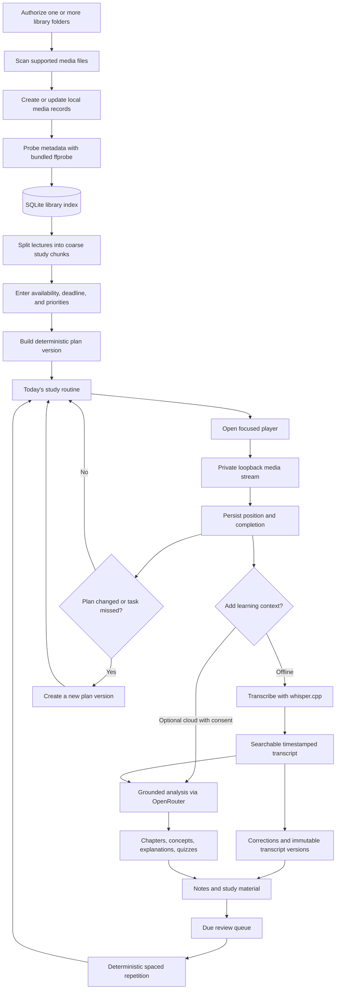
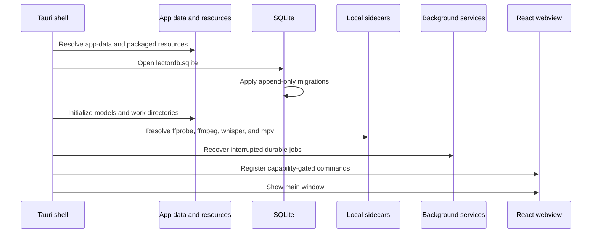
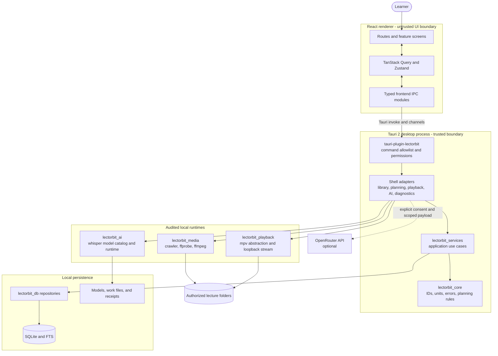

# LectorBit

> A local-first desktop workspace for planning, watching, transcribing, and reviewing video lectures.

LectorBit turns folders of lecture videos into a structured study system. It indexes only the folders a learner authorizes, extracts media metadata locally, builds deterministic study plans, tracks playback and progress, produces searchable English or Bangla transcripts, and supports review with notes, quizzes, and spaced repetition. Optional OpenRouter features add grounded learning assistance without making cloud access a requirement for the core application.

The current release line is **0.1.x** and targets **Windows 10/11 x64**. Other platforms are represented in the architecture, but do not yet have the same installer and smoke-test coverage.

## Table of contents

- [Highlights](#highlights)
- [How LectorBit works](#how-lectorbit-works)
- [System architecture](#system-architecture)
- [Component responsibilities](#component-responsibilities)
- [Data and privacy boundaries](#data-and-privacy-boundaries)
- [Technology stack](#technology-stack)
- [Repository structure](#repository-structure)
- [Install LectorBit on Windows](#install-lectorbit-on-windows)
- [Developer setup](#developer-setup)
- [Configuration](#configuration)
- [Build a Windows installer](#build-a-windows-installer)
- [Testing and quality checks](#testing-and-quality-checks)
- [Database migrations](#database-migrations)
- [Troubleshooting](#troubleshooting)
- [Release and security policy](#release-and-security-policy)
- [Project documentation](#project-documentation)
- [License](#license)

## Highlights

- **Local-first library:** Index user-approved folders without uploading the original video files.
- **Reliable metadata:** Extract duration, streams, codecs, dimensions, and related facts with a pinned `ffprobe` runtime.
- **Deterministic planning:** Build feasible schedules from time budgets, deadlines, priorities, prerequisites, and chunk durations. AI may propose typed constraints, but it does not control scheduling invariants.
- **Focused playback:** Resume lectures, preserve durable progress, navigate transcript evidence, and keep a learning trail tied to media timestamps.
- **Offline transcription:** Run whisper.cpp locally with English or multilingual/Bangla models downloaded on demand.
- **Grounded learning tools:** Create chapters, concepts, objectives, explanations, examples, quizzes, and study material with source timestamps and provenance.
- **Study and review:** Generate a due queue and schedule reviews with a deterministic SM-2-style algorithm.
- **Optional cloud AI:** Connect OpenRouter for selected features. Every request is scoped, consent-gated, and recorded with redacted provenance.
- **Operational visibility:** Inspect database, sidecar, model, job, and updater health from Diagnostics.

## How LectorBit works

The main learning workflow is intentionally incremental: useful local features remain available even when transcription, a model, or a cloud provider is unavailable.



### Planning contract

LectorBit separates suggestions from decisions. Cloud AI can propose prerequisite relationships or typed planning constraints; the Rust planning engine remains the authority for dates, feasibility, priority order, chunk placement, and review intervals. Replanning creates a new immutable plan version rather than silently rewriting history.

### Startup and recovery

On launch, the desktop shell resolves the application-data directory, opens SQLite, validates and applies embedded migrations, initializes the model catalog, resolves trusted sidecars, and resumes interrupted scan, probe, transcription, and learning jobs. The main window is shown only after the application services are ready.



## System architecture

LectorBit uses a layered desktop architecture. The React renderer contains presentation state only; it cannot access SQLite or arbitrary native APIs. All privileged work crosses a typed IPC boundary and is handled by Rust services.



### Architectural rules

1. **The renderer never opens the database.** UI code uses the modules under `lectorbit_frontend/src/ipc`.
2. **IPC is capability-gated.** The internal Tauri plugin exposes a narrow command surface instead of a general native bridge.
3. **Use cases live outside the shell.** `lectorbit_services` coordinates domain logic and repositories; `src-tauri` remains composition and platform integration.
4. **Core decisions are deterministic.** Planning and review invariants live in `lectorbit_core`, where they can be tested without a desktop runtime.
5. **Native processes do not receive shell strings.** Sidecars are launched with executable paths and argument arrays.
6. **Released migrations are append-only.** Existing migration bytes and checksums must not change.
7. **Packaged builds use packaged runtimes.** Release builds do not silently depend on an unrelated `ffprobe` or `ffmpeg` from the destination PC's `PATH`.

## Component responsibilities

| Component                | Responsibility                                                                                                                     |
| ------------------------ | ---------------------------------------------------------------------------------------------------------------------------------- |
| `lectorbit_frontend`     | React routes, forms, query caching, client state, validation, accessibility, and typed IPC clients.                                |
| `src-tauri`              | Desktop bootstrap, dependency composition, resource resolution, keyring integration, update adapter, and platform-specific wiring. |
| `tauri-plugin-lectorbit` | Capability-gated commands and event/channel contracts exposed to the renderer.                                                     |
| `lectorbit_core`         | Domain IDs, errors, units, scheduling constraints, planning invariants, and deterministic algorithms.                              |
| `lectorbit_services`     | Library, media, planning, playback, analysis, annotations, search, and diagnostics use cases.                                      |
| `lectorbit_db`           | SQLx/SQLite connection management, embedded migrations, repositories, full-text search, and redacted persistence diagnostics.      |
| `lectorbit_media`        | Folder crawling, media classification, metadata extraction, and FFmpeg/ffprobe process adapters.                                   |
| `lectorbit_ai`           | Local model catalog, download/verification rules, and whisper.cpp runtime integration.                                             |
| `lectorbit_playback`     | Playback engine abstraction, mpv process control, and durable playback behavior.                                                   |
| `scripts`                | Reproducible sidecar staging, installer builds, release configuration, checksums, and verification tests.                          |

## Data and privacy boundaries

### Stored locally

- Authorized library roots and indexed media metadata
- Plans, plan versions, chunks, deadlines, and progress
- Playback position and completion state
- Transcripts, corrections, chapters, notes, annotations, and study items
- Model catalog and downloaded local transcription models
- Redacted AI request provenance and operational diagnostics

The primary database is `lectordb.sqlite` inside the operating system's per-user application-data directory. The same directory contains `models`, `analysis-work`, and `playback-work`. On Windows, the directory is normally under the current user's roaming application data for the application identifier `dev.lectorbit.app`.

### Local media access

LectorBit reads only folders explicitly selected by the user. Playback is delivered to the webview through a private loopback server using opaque, short-lived media tokens; canonical filesystem paths are not exposed to renderer URLs.

### Optional cloud access

Offline indexing, planning, playback, transcription, search, and review do not require OpenRouter. When a cloud-assisted action is requested:

1. The user must configure a provider key and grant the required session/request consent.
2. The backend sends only the scoped transcript, planning context, or selected frame required for that action.
3. Credentials remain backend-owned and are stored through the operating system keyring where supported.
4. Logs and saved provenance exclude raw credentials, full provider responses, local paths, and unneeded source content.

## Technology stack

| Layer                | Technology                                                |
| -------------------- | --------------------------------------------------------- |
| Desktop shell        | Tauri 2.11, Rust 1.97, Tokio                              |
| Frontend             | React 19, TypeScript 6, Vite 8                            |
| Navigation and state | React Router 8, TanStack Query 5, Zustand 5               |
| Forms and validation | React Hook Form, Zod                                      |
| Styling              | Tailwind CSS 4, Lucide icons                              |
| Persistence          | SQLite through SQLx 0.9, SQLite FTS                       |
| Metadata and media   | FFmpeg/ffprobe 8.1.2                                      |
| Local transcription  | whisper.cpp 1.9.2                                         |
| Playback             | mpv abstraction; 0.41.0 is the audited target             |
| Optional cloud AI    | OpenRouter through a backend gateway                      |
| Tests                | Rust test framework, Vitest, Testing Library, WebdriverIO |

Versions are intentionally pinned or constrained in the checked-in manifests. The authoritative frontend versions are in `lectorbit_frontend/package.json`; Rust versions are in `lectorbit_backend/Cargo.toml` and `Cargo.lock`.

## Repository structure

```text
LectorBit/
├── lectorbit_frontend/             React and TypeScript renderer
│   ├── src/app/                    Application shell and providers
│   ├── src/routes/                 Home, Library, Plan, AI, Study, Player, Search...
│   ├── src/ipc/                    Only renderer-to-native API boundary
│   └── src/components/             Reusable UI components
├── lectorbit_backend/              Rust workspace
│   ├── crates/
│   │   ├── lectorbit_core/         Domain model and deterministic rules
│   │   ├── lectorbit_services/     Application services and orchestration
│   │   ├── lectorbit_db/           SQLite repositories and FTS
│   │   ├── lectorbit_media/        Scanning and media sidecars
│   │   ├── lectorbit_ai/           Local AI/model integration
│   │   └── lectorbit_playback/     Playback engine abstraction
│   ├── migrations/                 Append-only SQL migrations and checksums
│   ├── plugins/
│   │   └── tauri-plugin-lectorbit/ Capability-gated IPC plugin
│   └── src-tauri/                  Desktop entry point and Tauri configuration
├── scripts/                        Setup, staging, build, and release tooling
├── project-docs/                   Architecture, product, security, and runbooks
├── dev-setup.ps1                   Windows development bootstrap
└── README.md
```

## Install LectorBit on Windows

### Supported systems

- Windows 10 or Windows 11, x64
- Approximately 1 GB of free disk space for the application, bundled runtimes, and optional models
- Windows on ARM, 32-bit Windows, and Windows 7/8 are not currently supported

### Verify and install

1. Download the versioned `LectorBit_*_x64-setup.exe` and its `SHA256SUMS.txt` from a trusted release location.
2. Verify the installer hash in PowerShell:

   ```powershell
   Get-FileHash .\LectorBit_0.1.0_x64-setup.exe -Algorithm SHA256
   Get-Content .\SHA256SUMS.txt
   ```

3. For a public release, open **Properties → Digital Signatures** and verify that the LectorBit signature is valid.
4. Run the installer. It installs for the current user, so administrator access is normally unnecessary.
5. Start LectorBit from the installer finish page or the Start menu.

Local development packages include `UNSIGNED` in the filename. SmartScreen may warn about them; they are intended only for controlled evaluation and must not be redistributed as public releases.

### First launch

1. Open **Library** and select the folders LectorBit is allowed to index.
2. Wait for local scanning and metadata extraction to finish.
3. Open **Plan**, enter availability and priorities, and create the first routine.
4. Open a lecture in **Focused Study** to begin playback and progress tracking.
5. Install an English or multilingual model when transcription is needed. The base model is approximately 141 MiB; Bangla requires a multilingual model rather than an `.en` model.
6. Configure OpenRouter in **Settings** only if cloud-assisted learning tools are wanted.

For deployment details and Bengali installation notes, see [project-docs/INSTALL_WINDOWS.md](project-docs/INSTALL_WINDOWS.md).

## Developer setup

### Prerequisites

Install the following on Windows:

- Git
- Rust **1.97.1** with the MSVC target
- Microsoft Visual Studio C++ Build Tools and a Windows SDK
- Node.js **24**
- pnpm **11**
- FFmpeg/ffprobe **8.1.2** from the pinned Gyan build
- Microsoft Edge WebView2 Runtime

Optional for the complete local feature set:

- whisper.cpp **1.9.2** for transcription
- mpv **0.41.0** for the native playback adapter

### Clone and install dependencies

```powershell
git clone <your-repository-url> LectorBit
Set-Location .\LectorBit

rustup toolchain install 1.97.1
rustup default 1.97.1

corepack enable
corepack prepare pnpm@11 --activate
pnpm --dir .\lectorbit_frontend install --frozen-lockfile
```

Install the pinned media tools if they are not already available:

```powershell
winget install --id Gyan.FFmpeg --version 8.1.2 --source winget --exact `
  --accept-package-agreements --accept-source-agreements
```

Stage the verified whisper.cpp runtime for local transcription:

```powershell
& .\scripts\setup-whisper.ps1
```

The repository also provides `dev-setup.ps1`, which verifies or installs the pinned Windows dependencies and starts the application. Use the manual steps above when working under a managed Windows Application Control policy.

### Run the desktop application

Use the repository-pinned Tauri CLI. This avoids depending on a separately installed `cargo-tauri.exe` in the user profile:

```powershell
Set-Location .\lectorbit_backend
& ..\lectorbit_frontend\node_modules\.bin\tauri.cmd dev
```

The Tauri development command starts Vite automatically at `http://127.0.0.1:1420`, compiles the Rust workspace, and launches the desktop window.

If local policy permits globally installed Cargo subcommands, this equivalent command is also supported:

```powershell
Set-Location .\lectorbit_backend
cargo tauri dev
```

### Frontend-only development

```powershell
Set-Location .\lectorbit_frontend
pnpm dev --host 127.0.0.1 --port 1420
```

The browser preview is useful for layout work, but native IPC, filesystem access, playback, and sidecars require the Tauri desktop process.

## Configuration

The application prefers packaged resources in release builds. Runtime overrides are intended primarily for development and must use absolute executable paths.

| Variable                     | Scope                | Purpose                                                                           |
| ---------------------------- | -------------------- | --------------------------------------------------------------------------------- |
| `LECTORBIT_FFPROBE_PATH`     | Runtime, development | Absolute path to the approved `ffprobe` executable.                               |
| `LECTORBIT_FFMPEG_PATH`      | Runtime, development | Absolute path to the approved `ffmpeg` executable.                                |
| `LECTORBIT_WHISPER_PATH`     | Runtime, development | Absolute path to `whisper-cli` with its required DLLs beside it.                  |
| `LECTORBIT_MPV_PATH`         | Runtime, development | Absolute path to the mpv executable.                                              |
| `RUST_LOG`                   | Runtime              | Rust tracing filter, for example `lectorbit=debug,info`. Redaction still applies. |
| `LECTORBIT_BUILD`            | Compile time         | Build label shown in diagnostics; defaults to `dev`.                              |
| `LECTORBIT_UPDATER_ENDPOINT` | Compile time         | Signed updater manifest endpoint for a release channel.                           |
| `LECTORBIT_UPDATER_PUBKEY`   | Compile time         | Public key used to verify updater artifacts.                                      |

Example for the current PowerShell session:

```powershell
$env:LECTORBIT_FFPROBE_PATH = 'C:\Tools\ffmpeg-8.1.2\bin\ffprobe.exe'
$env:LECTORBIT_FFMPEG_PATH = 'C:\Tools\ffmpeg-8.1.2\bin\ffmpeg.exe'
$env:LECTORBIT_WHISPER_PATH = 'C:\Tools\whisper-1.9.2\whisper-cli.exe'
$env:RUST_LOG = 'lectorbit=debug,info'
```

Do not commit provider keys or local path overrides. OpenRouter credentials are configured through the application and owned by the backend/keyring integration.

## Build a Windows installer

The supported local packaging entry point is:

```powershell
.\scripts\build-windows-installer.ps1
```

The script verifies pinned FFmpeg/ffprobe bytes, validates the whisper.cpp manifest, stages sidecars and license records, builds a current-user NSIS installer, and writes the installer, receipt, and SHA-256 checksum under `artifacts/windows-local/`.

Useful modes:

```powershell
# Validate and stage runtime files without compiling the app
.\scripts\build-windows-installer.ps1 -StageOnly

# Use the WebView2 download bootstrapper instead of embedding the offline runtime
.\scripts\build-windows-installer.ps1 -WebViewInstallMode downloadBootstrapper

# Reuse an already-built binary after a bundle-only failure
.\scripts\build-windows-installer.ps1 `
  -WebViewInstallMode downloadBootstrapper -BundleOnly

# Faster, explicitly labelled local smoke-test package
.\scripts\build-windows-installer.ps1 `
  -DebugBuild -WebViewInstallMode downloadBootstrapper
```

The base Tauri pre-build hook also runs `scripts/stage-tauri-runtime.mjs`. Consequently, a plain Tauri build stages and packages the approved media runtimes instead of accidentally producing an installer that only works on the build machine.

```powershell
Set-Location .\lectorbit_backend
& ..\lectorbit_frontend\node_modules\.bin\tauri.cmd build
```

Use the packaging script for release candidates because it adds the complete provenance, receipt, naming, and checksum workflow.

## Testing and quality checks

Run checks from a clean developer shell with the pinned toolchain.

### Frontend

```powershell
Set-Location .\lectorbit_frontend
pnpm typecheck
pnpm lint
pnpm test
pnpm build
```

### Rust workspace

```powershell
Set-Location .\lectorbit_backend
cargo fmt --all -- --check
cargo test --workspace --no-fail-fast
cargo clippy --workspace --all-targets -- -D warnings
```

### Release tooling

```powershell
Set-Location <repository-root>
py -3 -m unittest discover -s scripts\release\tests -p 'test_*.py'
.\scripts\build-windows-installer.ps1 -StageOnly
```

### End-to-end tests

WebdriverIO and the Tauri WDIO plugins are included for native end-to-end coverage:

```powershell
Set-Location .\lectorbit_frontend
pnpm test:e2e
```

## Database migrations

SQL migrations live in `lectorbit_backend/migrations` and are embedded at compile time. `checksums.sha384` protects the exact bytes of every migration that may already exist in a user database.

Rules for schema changes:

1. Never edit, rename, reorder, or remove a migration that has been applied anywhere outside a disposable database.
2. Add a new timestamped migration for every schema or data correction.
3. Update the checked-in checksum manifest through the repository's migration process.
4. Test both a fresh database and an upgrade from the previous released schema.
5. Keep migrations transactional and compatible with recovery after interruption.

If startup reports that a migration “was previously applied but has been modified,” see [Migration checksum mismatch](#migration-checksum-mismatch). This is a safety failure, not a corrupt-media error.

## Troubleshooting

### `An Application Control policy has blocked this file` (`os error 4551`)

Windows blocked the executable before Tauri or the LectorBit code started. A common example is an unsigned global Cargo subcommand at `C:\Users\<user>\.cargo\bin\cargo-tauri.exe`. Changing directories, reinstalling the application database, or editing Rust code cannot bypass that operating-system policy.

Use the repository-pinned Node-based Tauri CLI:

```powershell
Set-Location .\lectorbit_backend
& ..\lectorbit_frontend\node_modules\.bin\tauri.cmd dev
```

On a managed device, the durable solution is approval from the administrator/security team or an organization-signed/allowlisted executable. Do not disable WDAC/AppLocker or other endpoint protection to work around the error.

### Migration checksum mismatch

Example:

```text
sqlite migration error: migration 202608190008 was previously applied but has been modified
```

This means the SQL bytes embedded in the current binary differ from the checksum recorded when that migration was applied. The correct repository fix is to restore the original migration and put the new change in a later migration.

```powershell
git diff -- .\lectorbit_backend\migrations\202608190008_ai_gateway.sql
```

For valuable data, back up `lectordb.sqlite` and restore the original migration source; do not alter SQLite's migration bookkeeping by hand. Only for a disposable development profile, close LectorBit, back up the app-data directory, then remove the development database and its `-wal`/`-shm` companions so the schema can be recreated. This deletes that profile's indexed library, plans, progress, transcripts, and study history.

### Installed app cannot parse metadata

Open **Diagnostics** and inspect the ffprobe status. A release build must contain `sidecars/ffprobe.exe` and `sidecars/ffmpeg.exe` in its Tauri resource directory. Rebuild through `scripts/build-windows-installer.ps1`; do not rely on the packaging PC's `PATH`. The staging step rejects the wrong version or hash before bundling.

For development, confirm the expected version and overrides:

```powershell
ffprobe -version
$env:LECTORBIT_FFPROBE_PATH
$env:LECTORBIT_FFMPEG_PATH
```

Both tools must report version 8.1.2. Files that fail probing stay indexed with an explicit unavailable metadata state so a single unsupported item does not prevent startup.

### Frontend server never becomes ready

Confirm that port 1420 is free and that dependencies were installed:

```powershell
pnpm --dir .\lectorbit_frontend install --frozen-lockfile
pnpm --dir .\lectorbit_frontend dev --host 127.0.0.1 --port 1420
```

Then open `http://127.0.0.1:1420` locally or restart the Tauri development command.

### Transcription component is unavailable

Run the verified setup script from the repository root and keep the resulting environment variable in the same PowerShell process used to launch Tauri:

```powershell
& .\scripts\setup-whisper.ps1
Set-Location .\lectorbit_backend
& ..\lectorbit_frontend\node_modules\.bin\tauri.cmd dev
```

Use a multilingual model for Bangla. Model names ending in `.en` support English only.

### Rust linker errors after an interrupted watcher

Close stale LectorBit processes, rerun the command, and allow Cargo to rebuild the desktop shell. The workspace already disables incremental compilation for the shell package to avoid incoherent Windows linker objects while retaining incremental builds for the internal crates.

## Release and security policy

LectorBit's public release path is fail-closed. A distributable release must have:

- audited, immutable sidecar sources with SHA-256 verification and license records;
- a valid Authenticode signature on the Windows installer;
- signed updater artifacts and a configured verification public key;
- an HTTPS update endpoint containing a valid signed manifest;
- clean frontend, Rust, release-script, installer, and smoke-test results; and
- no raw credentials, local media paths, transcript content, frames, or provider response bodies in logs or release receipts.

An `UNSIGNED` artifact under `artifacts/windows-local/` is a local evaluation build, not a public release. Review [project-docs/RELEASE.md](project-docs/RELEASE.md) and the audited [technology baseline](project-docs/TECHNOLOGY_BASELINE_2026-08.md) before publishing anything.

When reporting a vulnerability, do not attach private lecture content, API keys, database files, or unredacted diagnostics to a public issue.

## Project documentation

| Document                                                                      | Purpose                                                                   |
| ----------------------------------------------------------------------------- | ------------------------------------------------------------------------- |
| [INSTALL_WINDOWS.md](project-docs/INSTALL_WINDOWS.md)                         | End-user install, first launch, and local installer build instructions.   |
| [TECHNOLOGY_BASELINE_2026-08.md](project-docs/TECHNOLOGY_BASELINE_2026-08.md) | Audited dependency and runtime baseline.                                  |
| [AI_LEARNING_FEATURES.md](project-docs/AI_LEARNING_FEATURES.md)               | Implemented transcription, learning, provenance, and review capabilities. |
| [AI_INTEGRATION_ROADMAP.md](project-docs/AI_INTEGRATION_ROADMAP.md)           | Integration phases and remaining AI work.                                 |
| [RELEASE.md](project-docs/RELEASE.md)                                         | Signing, updater, sidecar, and release gate requirements.                 |
| [FOLDER_STRUCTURE.txt](project-docs/FOLDER_STRUCTURE.txt)                     | Detailed repository and module map.                                       |

## License

The Rust workspace and application bundle metadata declare the project as dual-licensed under **MIT OR Apache-2.0**. Third-party runtimes and models retain their own licenses; release builds must include the corresponding notices and provenance records.
